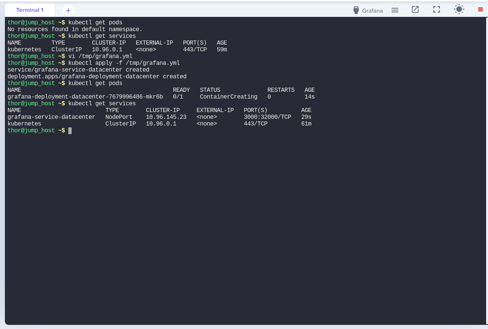
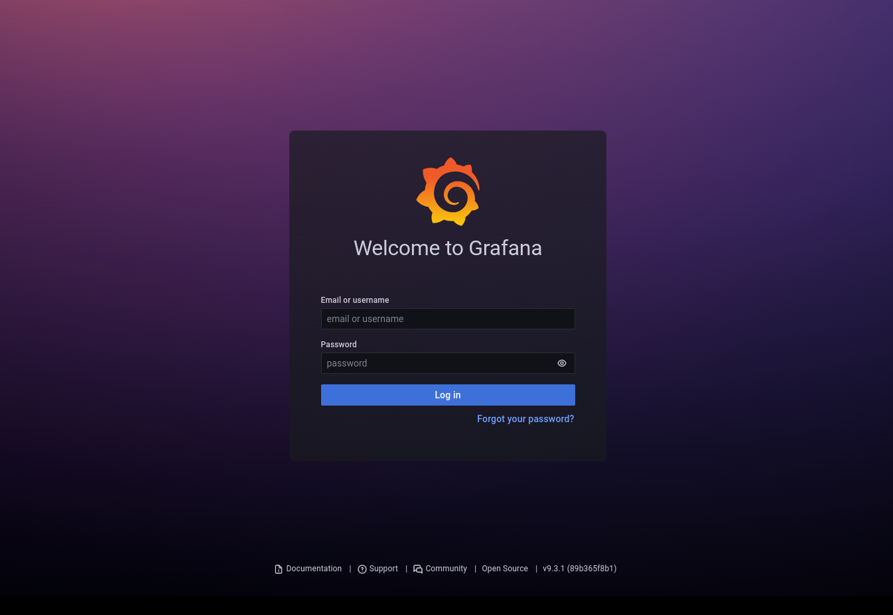

## Check for existing pods and services.
```
thor@jump_host ~$ kubectl get pods
```
#### Output:
```
No resources found in default namespace.
```
```
thor@jump_host ~$ kubectl get services
```
#### Output:
```
NAME         TYPE        CLUSTER-IP   EXTERNAL-IP   PORT(S)   AGE
kubernetes   ClusterIP   10.96.0.1    <none>        443/TCP   59m
```
## Make a yml file and add the following lines, then save and exit.

```
thor@jump_host ~$ vi /tmp/grafana.yml
```

```
apiVersion: v1
kind: Service
metadata:
  name: grafana-service-datacenter
spec:
  type: NodePort
  selector:
    app: grafana
  ports:
    - port: 3000
      targetPort: 3000
      nodePort: 32000
---
apiVersion: apps/v1
kind: Deployment
metadata:
  name: grafana-deployment-datacenter
spec:
  selector:
    matchLabels:
      app: grafana
  template:
    metadata:
      labels:
        app: grafana
    spec:
      containers:
         - name: grafana-container-datacenter
           image: grafana/grafana:latest
           ports:
             - containerPort: 3000
```

## Make use of "kubectl apply -f" to apply your manifest.

```
thor@jump_host ~$ kubectl apply -f /tmp/grafana.yml 
```
#### Output:
```
service/grafana-service-datacenter created
deployment.apps/grafana-deployment-datacenter created
```
## Make sure pods and services are working properly.

```
thor@jump_host ~$ kubectl get pods
```
#### Output:
```
NAME                                             READY   STATUS              RESTARTS   AGE
grafana-deployment-datacenter-7679996486-mkr6b   0/1     ContainerCreating   0          14s
```
```
thor@jump_host ~$ kubectl get services
```
#### Output:
```
NAME                         TYPE        CLUSTER-IP     EXTERNAL-IP   PORT(S)          AGE
grafana-service-datacenter   NodePort    10.96.145.23   <none>        3000:32000/TCP   29s
kubernetes                   ClusterIP   10.96.0.1      <none>        443/TCP          61m
```

## Validate the task by clicking on "Grafana port" on the toolbar.



### You must be able to access the Grafana login page.


