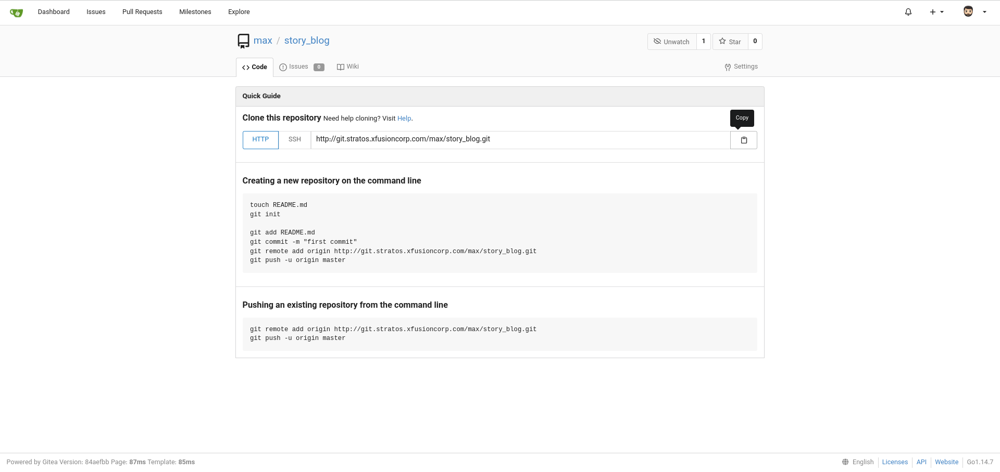

## Click on the Gitea UI button on the top bar, You should be able to access the Gitea UI.
' can't be established.
ECDSA key fingerprint is SHA256:0z85j/k+4Nf8WKbHJzxo1AOv4FeRA8LPET2N3BEkYyo.
ECDSA key fingerprint is MD5:74:e6:4d:c4:b3:80:07:be:03:30:0a:bf:1e:eb:e6:82.
Are you sure you want to continue connecting (yes/no)? yes
Warning: Permanently added 'ststor01,172.16.238.15' (ECDSA) to the list of known hosts.
max@ststor01's password: 
Welcome to xFusionCorp Storage server.
```

## Clone this newly created repository under user max home directory i.e /home/max.
```
max $ pwd
/home/max
```

```
max $ git clone http://git.stratos.xfusioncorp.com/max/story_blog.git
```
```
Cloning into 'story_blog'...
warning: You appear to have cloned an empty repository.
Checking connectivity... done.
```

##Copy all files from location /usr/dba to the repository and commit/push your changes to the master branch. The commit message must be "add stories"
```
max $ cd /home/max/story_blog/
```
```
max $ cp /usr/dba/* .
```
```
max $ ls -l
```
```
total 8
-rw-r--r--    1 max      max            792 Dec  2 11:21 frogs-and-ox.txt
-rw-r--r--    1 max      max           1086 Dec  2 11:21 lion-and-mouse.txt
```

```
max $ git status
```
```
On branch master

Initial commit

Untracked files:
  (use "git add <file>..." to include in what will be committed)

        frogs-and-ox.txt
        lion-and-mouse.txt

nothing added to commit but untracked files present (use "git add" to track)
```
```
max $ git add .
```
```
max $ git commit -m "add stories"
```
```
[master (root-commit) d82f3b7] add stories
 Committer: Linux User <max@ststor01.stratos.xfusioncorp.com>
Your name and email address were configured automatically based
on your username and hostname. Please check that they are accurate.
You can suppress this message by setting them explicitly. Run the
following command and follow the instructions in your editor to edit
your configuration file:

    git config --global --edit

After doing this, you may fix the identity used for this commit with:

    git commit --amend --reset-author

 2 files changed, 42 insertions(+)
 create mode 100644 frogs-and-ox.txt
 create mode 100644 lion-and-mouse.txt
```
``` 
max (master)$ git push -u origin master
```
```
Username for 'http://git.stratos.xfusioncorp.com': max
Password for 'http://max@git.stratos.xfusioncorp.com': 
Counting objects: 4, done.
Delta compression using up to 36 threads.
Compressing objects: 100% (4/4), done.
Writing objects: 100% (4/4), 1.19 KiB | 0 bytes/s, done.
Total 4 (delta 0), reused 0 (delta 0)
remote: . Processing 1 references
remote: Processed 1 references in total
To http://git.stratos.xfusioncorp.com/max/story_blog.git
 * [new branch]      master -> master
Branch master set up to track remote branch master from origin.
```
## Create a new branch max_apps from master

```
max (master)$ git checkout -b max_apps
```
```
Switched to a new branch 'max_apps'
```
```
max (max_apps)$ ls -l
```
```
total 8
-rw-r--r--    1 max      max            792 Dec  2 11:21 frogs-and-ox.txt
-rw-r--r--    1 max      max           1086 Dec  2 11:21 lion-and-mouse.txt
```
## Copy a file story-index-max.txt from location /tmp/stories/ to the repository
```
max (max_apps)$ cp /tmp/stories/story-index-max.txt .
```
## This file has a typo, which you can fix by changing the word Mooose to Mouse
```
max (max_apps)$ vi story-index-max.txt 
```
```
1. The Lion and the Mooose => Mouse
2. The Frogs and the Ox
3. The Fox and the Grapes
4. The Donkey and the Dog
```
## Commit and push the changes to the newly created branch. Commit message must be "typo fixed for Mooose"
```
max (max_apps)$ git status

```
```
On branch max_apps
Untracked files:
  (use "git add <file>..." to include in what will be committed)

        story-index-max.txt

nothing added to commit but untracked files present (use "git add" to track)
```
```
max (max_apps)$ git add .
```
```
max (max_apps)$ git commit -m "typo fixed for Mooose"
```
```
[max_apps 83f712d] typo fixed for Mooose
Committer: Linux User <max@ststor01.stratos.xfusioncorp.com>
Your name and email address were configured automatically based
on your username and hostname. Please check that they are accurate.
You can suppress this message by setting them explicitly. Run the
following command and follow the instructions in your editor to edit
your configuration file:

    git config --global --edit

After doing this, you may fix the identity used for this commit with:

    git commit --amend --reset-author

 1 file changed, 4 insertions(+)
 create mode 100644 story-index-max.txt
 
 
``` 
 max (max_apps)$ git push -u origin max_apps
```
```
Username for 'http://git.stratos.xfusioncorp.com': max
Password for 'http://max@git.stratos.xfusioncorp.com': 
Counting objects: 3, done.
Delta compression using up to 36 threads.
Compressing objects: 100% (3/3), done.
Writing objects: 100% (3/3), 413 bytes | 0 bytes/s, done.
Total 3 (delta 0), reused 0 (delta 0)
remote: 
remote: Create a new pull request for 'max_apps':
remote:   http://git.stratos.xfusioncorp.com/max/story_blog/compare/master...max_apps
remote: 
remote: . Processing 1 references
remote: Processed 1 references in total
To http://git.stratos.xfusioncorp.com/max/story_blog.git
 * [new branch]      max_apps -> max_apps
Branch max_apps set up to track remote branch max_apps from origin. 
``` 
 
